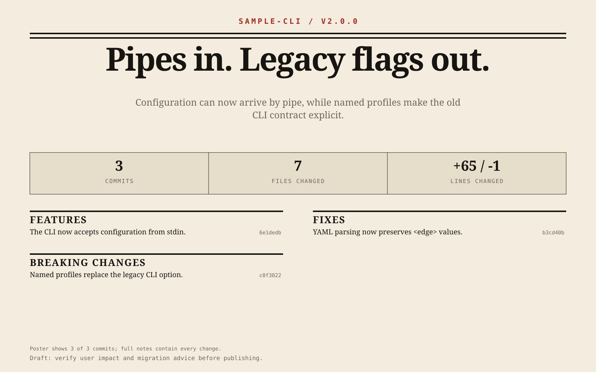

# Release Front Page

**把两个 Git Ref 之间的真实变更，变成有证据的发布说明、可打印的报纸头版和社交分享卡——但绝不自动发布。**

[English](README.md)



Git 日志是很好的证据，却是很差的头版。Release Front Page 保留每条证据，再用一套受约束的编辑流程，帮 Agent 将技术提交翻译成用户看得懂的发布材料。

```text
之前                                        之后
feat(cli): accept configuration from stdin  CLI 现在可以从标准输入读取配置 · 6e1dedb
fix: preserve <edge> values in YAML         YAML 解析会保留 <edge> 值 · b3cd40b
feat(cli)!: replace the legacy option       破坏性变更＋已核对迁移方法 · c0f3022
```

上图由[可重复构建的真实 Git Fixture](examples/sample-release/build_fixture.py)生成，不是手工 Mockup。Fixture 构建脚本会先运行行为测试，再由 CI 逐字节重建验证其 Commit、源码、迁移文档、JSON、Markdown、HTML 与 SVG。

## 输出什么

- `release-data.json`：稳定、可追溯的事实与多语言编辑字段
- `RELEASE_NOTES_DRAFT.md`：每条都保留 SHA/PR 来源的发布说明草稿
- `release-front-page.html`：响应式、可打印、自包含 HTML
- `release-front-page.svg`：1600×1000 报纸头版
- `release-social-card.svg`：1200×630 社交分享卡

英文和简体中文使用同一份 JSON 契约渲染。核心功能只需 Python 3.11+ 和本地 Git；不需要 Node、浏览器、网络、API Key 或第三方 Python 包。

## 安装

### Codex marketplace

把仓库 marketplace 固定到本次版本，再从 Codex 的 Plugins 页面安装 **Release Front Page**：

```bash
codex plugin marketplace add gezi71/release-front-page --ref v1.0.0
```

### 跨 Agent Skills CLI

此方式需要 Node.js 和网络：

```bash
npx skills add gezi71/release-front-page --skill release-front-page -g -a codex -y
```

### 本地开发

克隆仓库，然后复制到当前通用 Skill 目录：

```bash
mkdir -p "$HOME/.agents/skills"
cp -R skills/release-front-page "$HOME/.agents/skills/release-front-page"
```

然后这样调用：

```text
使用 $release-front-page 对比 v1.4.0..v2.0.0，生成中文发布说明和
broadsheet 风格头版。不要发布任何内容。
```

## 直接使用离线脚本

先采集本地 Git 事实：

```bash
python3 skills/release-front-page/scripts/collect_release.py \
  --repo /path/to/repository \
  --from v1.4.0 \
  --to v2.0.0 \
  --version v2.0.0 \
  --output release-data.json
```

人工核对 JSON 中的用户影响与 Diff，再渲染：

```bash
python3 skills/release-front-page/scripts/render_release.py \
  --input release-data.json \
  --out-dir release-package \
  --locale zh-CN \
  --theme broadsheet
```

可选语言为 `en` / `zh-CN`，主题为 `broadsheet` / `modern`。Merge 提交和贡献者显示名默认不采集。公开 PR 信息也必须显式传入 `--use-gh`，它是核心流程中唯一可能使用网络的路径。如果 `gh` 不存在、未登录或 origin 不合适，离线发布包仍会成功生成，并把原因写入 `github_enrichment.failure_reason`。

可以从确定性 Git 历史重建签入的全部示例产物：

```bash
python3 examples/sample-release/build_fixture.py --out-dir examples/sample-release
```

## 证据先于形容词

采集器只负责确定性数据和保守的 Conventional Commit 分类。每个 Commit 的 `highlight` 默认都是 `false`，只有证据复核才能显式选出最多三条头版亮点。Skill 会要求 Agent 先查看 Diff，再改写摘要；每条主要陈述都要保留证据来源，内部重构不得包装成新功能。

| 结论 | 必需证据 |
|---|---|
| 用户可见功能 | 公共接口、测试或文档变更 |
| 性能改善 | 测量数据或已链接的 Benchmark |
| 破坏性变更 | 明确的契约破坏或 `BREAKING CHANGE` footer |
| 迁移方法 | 经过核对的代码、测试、文档或显式 footer |
| 安全影响 | 已公开证据与维护者批准 |

它可以与 [git-cliff](https://github.com/orhun/git-cliff) 和 [Release Drafter](https://github.com/release-drafter/release-drafter) 配合。后两者是优秀的确定性 Changelog 基础；Release Front Page 增加的是有证据约束的编辑流程和视觉交付，不会取代 Git 数据。

## 支持范围

- 本地 Git Range、分支、Tag、Conventional Commits、Revert、可选 Merge、区间净变化统计，以及逐提交 First-parent 统计
- 新功能、修复、性能、开发者体验、文档、破坏性变更、迁移、亮点与未分类变更
- 同一份结构化数据中的英文和简体中文
- Markdown、自包含 HTML 和自包含 SVG

## 限制

- Commit 和 Diff 能支持结论，但不能证明用户的真实体验。
- 非 Conventional Commit 消息可能保留在 `Other`，等待 Agent 或维护者审核。
- Merge 的文件统计是与第一个 Parent 比较的结果。
- 离线时不能查询 PR，且只有显式传入 `--use-gh` 才会开启。
- PR 证据只接受属于当前仓库的精确 GitHub URL；请求、成功数量和失败原因都会记录在 JSON。
- Commit 文本中的邮箱形态内容和身份 Trailer 会被移除。贡献者显示名默认关闭，但草稿仍必须经过隐私复核。
- Renderer 只接受 JSON schema `1.0`；它与仓库版本 `v1.0.0` 分开维护。
- 所有产物都是草稿。工具绝不修改 CHANGELOG、创建 Tag、发布 GitHub Release 或 Push 分支。
- PNG 导出是可选增强，刻意不放进无浏览器依赖的核心流程。

## 开发验证

```bash
python3 -m unittest discover -s tests -v
python3 /path/to/skill-creator/scripts/quick_validate.py skills/release-front-page
python3 /path/to/plugin-creator/scripts/validate_plugin.py .
```

测试会创建临时 Git 仓库，覆盖新功能、修复、破坏性变更、文档、Revert、Merge、空范围、无效 Ref、Unicode、贡献者隐私、Schema 与 provenance 拒绝、长版本发布、稳定输出和 XML 合法性。

发布或贡献前，请阅读 [CHANGELOG.md](CHANGELOG.md)、[CONTRIBUTING.md](CONTRIBUTING.md) 和 [SECURITY.md](SECURITY.md)。

## 许可证

[MIT](LICENSE)
